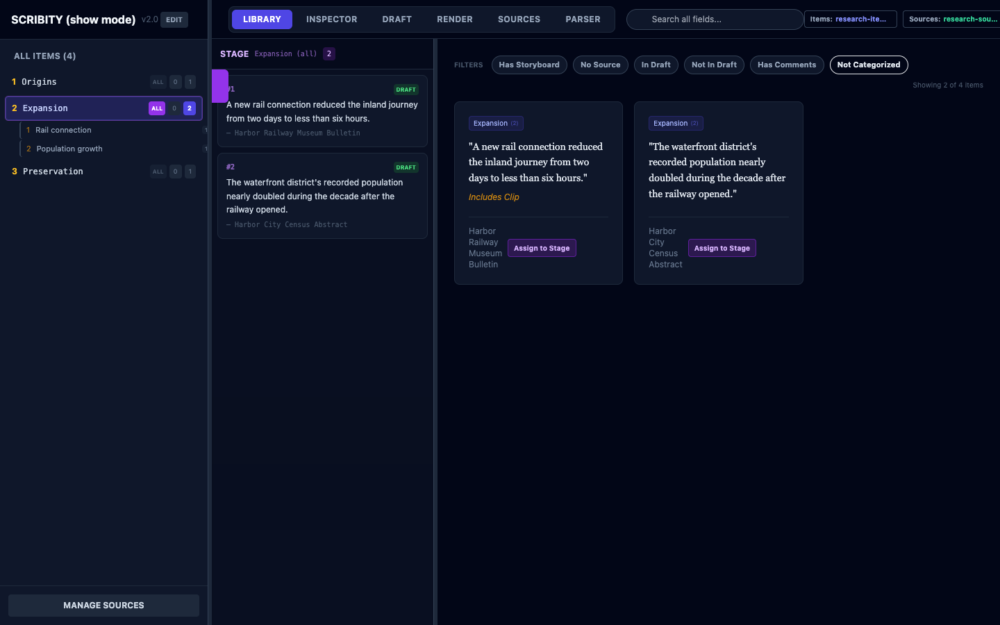

# Scribity

**A local-first research and writing workspace for organizing sources, structuring evidence, and drafting source-backed narratives.**



> **Project status:** Active development. Scribity is usable today, but its interface and document formats may continue to evolve.

Scribity keeps research documents on the user's computer and combines source management, evidence organization, drafting, and import tools in one focused workspace. It supports both general research projects and a specialized rule-and-example workflow originally designed for instructional writing.

## Highlights

- Local JSON documents remain under the user's control.
- Items link directly to structured source records.
- Categories, subparts, tags, filters, and a reorderable Stage help shape large collections of evidence.
- Draft and Render views turn selected material into an ordered narrative.
- An MDX parser previews structured report imports before saving them.
- Optimistic document revisions reject stale saves from old tabs or previously opened files.
- Paired item/source writes use validation, temporary files, and rollback protection.
- Undo history and delayed saves are isolated when switching documents.
- macOS and Windows launchers are included.

## Technology

- Python, Flask, and Flask-CORS for the local server and file operations
- React 18, Tailwind CSS, and Lucide for the browser interface
- Python `unittest` and Playwright for automated regression coverage
- JSON documents for portable, inspectable storage

Scribity is intentionally small and local: there is no account system, hosted database, analytics service, or cloud synchronization layer.

## Quick start

Requirements:

- Python 3.10 or newer
- A current desktop browser
- Node.js only if you want to run the browser tests

```bash
git clone https://github.com/Swampd/scribity.git
cd scribity
python3 -m venv .venv
source .venv/bin/activate
python -m pip install -r requirements.txt
python start_scribity.py
```

On Windows, activate the environment with `.venv\Scripts\activate` and run `python start_scribity.py`. The included `scribity.command` and `scribity.bat` launchers are also available for macOS and Windows.

Scribity opens at [http://localhost:8000](http://localhost:8000). To explore without personal data, use the file controls to open:

- Items: `examples/research-items.json`
- Sources: `examples/research-sources.json`

The `examples/` directory also includes an improv-oriented document pair. Every included example record is synthetic and exists only to demonstrate the interface.

## How documents work

Scribity uses two related JSON arrays:

| Document | Purpose |
| --- | --- |
| Items | Quotations, notes, examples, categories, ordering, and drafting metadata |
| Sources | Bibliographic and reference information linked through `id_source` |

Starter structures are available in `schema_research_items.json`, `schema_improv_items.json`, and `schema_sources.json`. User documents and `scribity_config.json` are ignored by Git so personal research is not committed accidentally.

## Data-safety design

The application treats document integrity as a first-class concern:

1. Loads and saves require arrays of JSON objects.
2. Every active document receives an opaque token and revision.
3. Saves from an old document or stale browser tab are rejected.
4. Delayed edits are flushed before a document switch completes.
5. Operations that update both item and source files stage both writes and roll back if the second commit fails.

These safeguards are covered by server, parser, document-session, accessibility, and browser-interaction tests.

## Testing

Run the Python suite:

```bash
python3 -B -m unittest discover
```

Run the browser suite:

```bash
npm install
npx playwright install chromium
npm run test:e2e
```

The Playwright suite serves the dashboard locally and uses in-memory API responses; it does not open or modify configured research documents. See [TESTING.md](TESTING.md) for details.

## Privacy

Scribity does not upload document contents. File selection, parsing, and saves happen through the local Flask server. The following local files are intentionally excluded from version control:

- `items.json`
- `sources.json`
- `scribity_config.json`
- temporary JSON writes and browser-test output

Before sharing a fork, review its complete Git history as well as its current files; deleting sensitive content in a later commit does not remove it from earlier commits.

## Copyright

Copyright © 2026 Casey Auttonberry. All rights reserved.

No open-source license is granted for Scribity at this time. The source is visible for portfolio and evaluation purposes; see [COPYRIGHT.md](COPYRIGHT.md) for details. Third-party libraries remain subject to their respective licenses.

